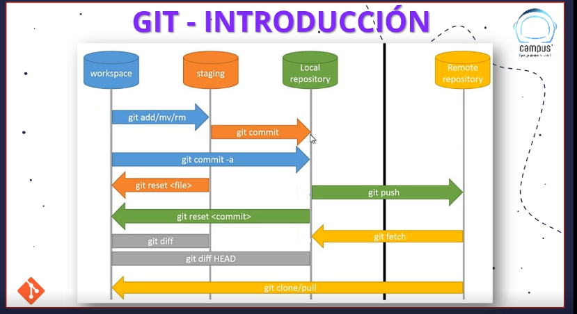

# SISTEMA DE CONTROL DE VERSIONES (VCS)

## INTRODUCCION
> Guarda las líneas de cambio/modificación 
## TIPOS
### 1.LOCALES
### 2. CENTRALIZADOS
>>>> Se pasan las copias a un servidor dedicado, es decir es un sistema cl - servidor.
### 3. DISTRIBUIDOS
>>>> Tdoso los usuarios tienen una copia del código fuente completo. Aún así hay una copia central.

## GIT - AREAS
> Existe la zona de **trabajo**, la **stagin** **directory**, y el **repositorio**!
> El flujo se´ria del working directoy, se hace el add, llega al staging directory, y con el commit se envía al repository

### DIRECTORIO DE TRABAJO
> Es donde se inicializa git, hay ficheros que no están en seguimiento -Untracked- 
### Zona de preparación -STAGING-
> Los ficheros que deseamos que estén en seguimiento. Git nos indica si el fichero es nuevo o no para hacer las operaciones respectivas
### REPO GIT / ZONA DE COMMITS
> Son los cambios confirmados después de las verificaciones!
>Estos cambios se aplicaran directamente sobre el directorio de trabajo y se inicia el ciclo nuevamente.
### REMOTO - REMOTE REPO
> + Cuándo está en el local repo, se envía un git push al repo remoto;
> + con git fetch se baja el repo que están en el remoto al local, pero lo mantiene en la zona de commits
> + Con git pull copias el repositorio y quedas en el directorio de trabajo
